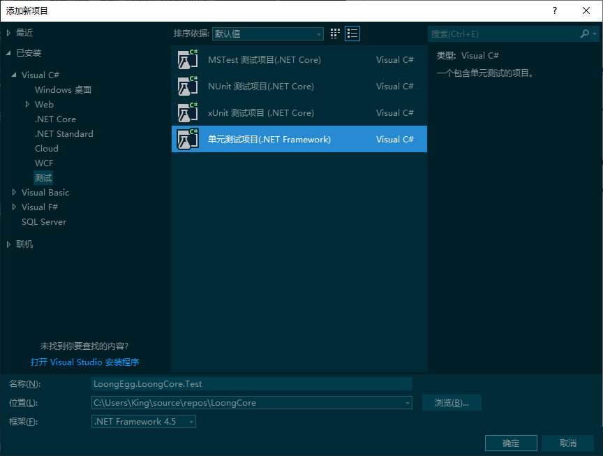
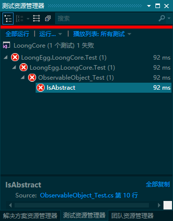
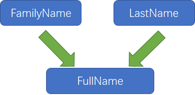
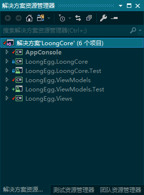
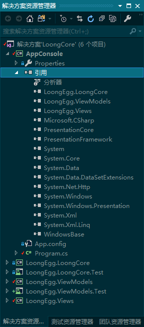

# LoongCore 深入理解MVVM
>最好的深入了解，动手实践

个人手撸, 并通过单元测试来了解MVVM框架的内涵

## 12.Abstract和单元测试初体验

1. 定义ObservableObject类
由于这是我们将来ViewModel的基类，所以它并没有实际含义，应该定为抽象类，但此处故意忘记
```c#
    public class ObservableObject : INotifyPropertyChanged
    {
              public event PropertyChangedEventHandler PropertyChanged;
 
    }
```
2. 新建单元测试


3. 在单元测试项目中确认ObservableObject为抽象类
```c#
    [TestClass]
    public class ObservableObject_Test
    {
        [TestMethod]
        public void IsAbstract() {

            var type = typeof(ObservableObject);
            Assert.IsTrue(type.IsAbstract);
        }
    }
```

4. 在测试资源管理器中运行测试   


5. 修改ObservableObject后测试通过
```c# 
    public abstract class ObservableObject : INotifyPropertyChanged
    {
              public event PropertyChangedEventHandler PropertyChanged;
 
    } 
```

## 13.PropertyChanged属性改变时发生了什么

1. ```ObservableObject.cs```属性改变时引发事件的底层方法
```c#
        // TODO: 13-1 引发属性改变事件的方法
        /// <summary>
        ///     引发属性改变事件
        /// </summary>
        ///     <param name="propertyName">发生改变的属性的名称</param>
        /// <remarks>
        ///     ?. 操作符如果有人给ViewModel留了“名片”才会引发，即外部有人订阅了PropertyChanged
        ///     没有这个方法是可以的，但是你可能得硬编码写propertyName
        /// </remarks>
        protected void RaisePropertyChanged([CallerMemberName] string propertyName = null)
            => PropertyChanged?.Invoke
                                (
                                    this,
                                    new PropertyChangedEventArgs(propertyName)
                                );
```
2. ```ObservableObject.cs```属性设置器，当待设置的值确实为新值时会调用RaisePropertyChanged
```c#
        // TODO: 13-2 属性设置器
        /// <summary>
        /// 设置新的属性值,如果是“真的新”，调用<seealso cref="RaisePropertyChanged(string)"/>
        /// </summary>
        ///     <typeparam name="T">目标属性的类型</typeparam>
        ///     <param name="target">目标属性</param>
        ///     <param name="value">可能是新的值</param>
        ///     <param name="propertyName">[不要设置]目标属性的名称，自动推断</param>
        /// <returns>[true]目标属性已被更新？</returns>
        protected bool SetProperty<T>
            (
                    ref T target, // 目标属性
                    T value,      // “新”值
                    [CallerMemberName] string propertyName = null
            ) {
            if (EqualityComparer<T>.Default.Equals(target, value))
                return false;

            target = value;
            RaisePropertyChanged(propertyName);
            return true;
        }
```
3. 单元测试
```c#
using System;
using Microsoft.VisualStudio.TestTools.UnitTesting;
// TODO: 13-3 引用Logger记录器
using LoongEgg.LoongLogger;

namespace LoongEgg.LoongCore.Test
{
    [TestClass]
    public class ObservableObject_Test
    {
        // TODO: 13-4 测试初始化
        /// <summary>
        /// 初始化测试，会在所有测试方法前调用
        /// </summary>
        /// <remarks>
        ///     LoongEgg.LoongLogger是我的一个开源项目，你可以不使用
        /// </remarks>
        [TestInitialize]
        public void EnabledLogger() {
            LoggerManager.Enable(LoggerType.File, LoggerLevel.Debug);
        }
        
        /// <summary>
        /// 抽象类确认
        /// </summary>
        [TestMethod]
        public void IsAbstract() {
            var type = typeof(ObservableObject);
            Assert.IsTrue(type.IsAbstract);
        }

        // TODO: 13-5 设计一个测试类
        /// <summary>
        /// <see cref="ObservableObject"/>的一个测试样本
        /// </summary>
        public class ObservableObjectSample : ObservableObject
        {
            /// <summary>
            /// 测试属性
            /// </summary>
            public int PropertySample {
                get => _PropertySample;
                set => SetProperty(ref _PropertySample, value);
            }
            /// <summary>
            /// 测试字段
            /// </summary>
            private int _PropertySample;

        }

        // TODO: 13-6 属性改变时会发生什么
        /// <summary>
        /// 属性改变，且会引发事件确认
        /// </summary>
        [TestMethod] 
        public void CanPropertyChangedRaised() {
            bool isPropertyChangeRaised = false;// 事件引发标记

            // 初始化一个检测样本
            ObservableObjectSample sample = new ObservableObjectSample();

            // 注册属性改变时的处理事件
            sample.PropertyChanged += (s, args) =>
                                        {
                                            isPropertyChangeRaised = true;
                                            LoggerManager.WriteDebug($"PropertyName:{args.PropertyName}");
                                        };

            // 改变属性
            sample.PropertySample = 666;
            Assert.IsTrue(isPropertyChangeRaised);
            Assert.AreEqual(sample.PropertySample, 666);
        }

        // TODO: 13-7 清理测试环境
        /// <summary>
        /// 在所有测试完成后调用，注销LoggerManager
        /// </summary>
        [TestCleanup]
        public void DisableLogger() {
            LoggerManager.WriteDebug("LoggerManager is clean up...");
            LoggerManager.Disable();
        }

    }
}

```

## 14.在正确的时机引发通知

1. 属性不真正改变的时候不要引发事件
```c#
        // TODO: 14-1 当“新值”等于当前值时不引发通知
        /// <summary>
        /// 当“新值”等于当前值时不引发通知
        /// </summary>
        public void WhenPropertyEqualsOldValue_NotRaised() {
            bool isPropertyChangeRaised = false;// 事件引发标记

            // 初始化一个检测样本
            // 注意这里赋了一个初始值
            ObservableObjectSample sample = new ObservableObjectSample { PropertySample = 666};

            // 注册属性改变时的处理事件
            sample.PropertyChanged += (s, args) =>
                                        {
                                            isPropertyChangeRaised = true;
                                            LoggerManager.WriteDebug( 
                                                $"Event is raised by PropertyName={args.PropertyName}, value={sample.PropertySample}");
                                        };

            // 改变属性
            sample.PropertySample = 666;
            Assert.IsFalse(isPropertyChangeRaised); // 注意这里断言是Flase
            Assert.AreEqual(sample.PropertySample, 666);
        }

```
2. 创建ViewModelBase.cs
```c#
    // TODO: 14-2 设计ViewModel的基类
    /// <summary>
    /// ViewModel们继承于此
    /// </summary>
    public abstract class ViewModelBase : ObservableObject { }
```
3. 依赖于它人的属性改变事件，由被依赖者引发

  
在```ViewModelBase_Test.cs```增加测试类
```c#
public class People: ViewModelBase
        {

            public string FamilyName {
                get => _FamilyName;
                set {
                    if (SetProperty(ref _FamilyName, value))
                        RaisePropertyChanged("FullName");
                }
            }
            private string _FamilyName = "[NotDefined]";


            public string LastName {
                get => _LastName;
                set {
                    if (SetProperty(ref _LastName, value))
                        RaisePropertyChanged(nameof(FullName));
                }
            }
            private string _LastName = "[Unknown]";

            public string FullName => $"{FamilyName} - {LastName}";
        }
```
4.完整的单元测试
```c#
using System;
using LoongEgg.LoongLogger;
using Microsoft.VisualStudio.TestTools.UnitTesting;

namespace LoongEgg.LoongCore.Test
{
    [TestClass]
    public class ViewModelBase_Test
    {   /// <summary>
        /// 初始化测试，会在所有测试方法前调用
        /// </summary>
        /// <remarks>
        ///     LoongEgg.LoongLogger是我的一个开源项目，你可以不使用
        /// </remarks>
        [TestInitialize]
        public void EnabledLogger() {
            LoggerManager.Enable(LoggerType.File, LoggerLevel.Debug);
            LoggerManager.WriteDebug("Test initialized ok ....");
        }
        
        // TODO: 14-3设计测试类People
        public class People: ViewModelBase
        {

            public string FamilyName {
                get => _FamilyName;
                set {
                    if (SetProperty(ref _FamilyName, value))
                        RaisePropertyChanged("FullName");
                }
            }
            private string _FamilyName = "[NotDefined]";


            public string LastName {
                get => _LastName;
                set {
                    if (SetProperty(ref _LastName, value))
                        RaisePropertyChanged(nameof(FullName));
                }
            }
            private string _LastName = "[Unknown]";

            public string FullName => $"{FamilyName} - {LastName}";
        }

        // TODO: 14-4 检查可以强制引发属性改变事件
        [TestMethod]
        public void CanRaisedByOtherProperty() {

            People people = new People();
            bool isRaised = false;
            people.PropertyChanged += (s, e) =>
                                        {
                                            isRaised = true;
                                            if(e.PropertyName == "FullName") {
                                                LoongLogger.LoggerManager.WriteDebug($"FullName is changed to -> {people.FullName}");
                                            }
                                        };

            people.FamilyName = "Alpha";
            people.LastName = "Jet";
            Assert.IsTrue(isRaised);
        }
         
        /// <summary>
        /// 在所有测试完成后调用，注销LoggerManager
        /// </summary>
        [TestCleanup]
        public void DisableLogger() {
            LoggerManager.WriteDebug("LoggerManager is clean up...");
            LoggerManager.Disable();
        }
    }
}

```

## 15.ICommand命令的实现
1. ICommand的实现```DelegateCommand.cs```
```c#
using System;
using System.Windows.Input;

/* 
 | 个人微信：InnerGeeker
 | 联系邮箱：LoongEgg@163.com 
 | 创建时间：2020/4/12 18:28:22
 | 主要用途：
 | 更改记录：
 |			 时间		版本		更改
 */
namespace LoongEgg.LoongCore
{

    public class DelegateCommand : ICommand
    {
        /*---------------------------------------- Fields ---------------------------------------*/
        /// <summary>
        /// 干活的方法
        /// </summary>
        private readonly Action<object> _Execute;
        /// <summary>
        /// 判断可以干活的方法
        /// </summary>
        private readonly Predicate<object> _CanExecute;

        public bool CanExecuteCache { get; private set; } = true;
 
        /*------------------------------------- Constructors ------------------------------------*/
        /// <summary>
        /// 主构造器
        /// </summary>
        /// <param name="execute">干活的方法</param>
        /// <param name="canExecute">判断可以干活的方法</param>
        public DelegateCommand(Action<object> execute, Predicate<object> canExecute) {
            _Execute = execute ?? throw new ArgumentNullException("execute 不能为空");
            _CanExecute = canExecute;
        }

        /// <summary>
        /// 构造器
        /// </summary>
        /// <param name="execute">干活的方法</param>
        public DelegateCommand(Action<object> execute) : this(execute, null) { }
         
        public event EventHandler CanExecuteChanged;

        /*------------------------------------ Public Methods -----------------------------------*/
        /// <summary>
        /// 检查是否可以执行命令
        /// </summary>
        /// <param name="parameter"></param>
        /// <returns></returns>
        public bool CanExecute(object parameter) {
           bool canExecute = _CanExecute?.Invoke(parameter) ?? true;

            if(canExecute != CanExecuteCache) {
                CanExecuteCache = canExecute;
                RaiseCanExecuteChanged();
            }

            return canExecute;
        }

        /// <summary>
        /// 执行命令操作
        /// </summary>
        /// <param name="parameter"></param>
        public void Execute(object parameter) => _Execute(parameter);

        /// <summary>
        /// 引发可执行改变事件
        /// </summary>
        public void RaiseCanExecuteChanged() => CanExecuteChanged?.Invoke(this, EventArgs.Empty);
    }
}

```
2.DelegateCommand的单元测试
```c#
using System;
using LoongEgg.LoongLogger;
using Microsoft.VisualStudio.TestTools.UnitTesting;

namespace LoongEgg.LoongCore.Test
{
    [TestClass]
    public class DelegateCommand_Test
    {
        /// <summary>
        /// 初始化测试，会在所有测试方法前调用
        /// </summary>
        /// <remarks>
        ///     LoongEgg.LoongLogger是我的一个开源项目，你可以不使用
        /// </remarks>
        [TestInitialize]
        public void EnabledLogger() {
            LoggerManager.Enable(LoggerType.File, LoggerLevel.Debug);
            LoggerManager.WriteDebug("Test initialized ok ....");
        }

        /// <summary>
        /// 检查在构造器中execute不能为null
        /// </summary>
        [TestMethod]
        [ExpectedException(typeof(ArgumentNullException))]
        public void Constructor_ThrowExectptionIfActionParameterIsNull() {
            var command = new DelegateCommand(null);
        }

        /// <summary>
        /// Action可以被正常委托执行
        /// </summary>
        [TestMethod]
        public void ExecuteAction_CanInvokes() {
            bool invoked = false;

            void action(object obj) => invoked = true;

            var command = new DelegateCommand(action);
            command.Execute(null);

            Assert.IsTrue(invoked);
        }

        /// <summary>
        /// CanExecute为Null时命令默认可以执行
        /// </summary>
        [TestMethod]
        public void CanExecute_IsTrueByDefault() {
            var command = new DelegateCommand(obj => { });
            Assert.IsTrue(command.CanExecute(null));
        }

        /// <summary>
        /// CanExecute可以判断命令不能执行
        /// </summary>
        [TestMethod]
        public void CanExecute_FalsePredicate() {
            var command = new DelegateCommand
                                    (
                                        obj => { },
                                        obj => (int)obj == 0
                                    );
            Assert.IsFalse(command.CanExecute(6));
        }

        /// <summary>
        /// CanExecute可以判断命令可以执行
        /// </summary>
        [TestMethod]
        public void CanExecute_TruePredicate() {
            var command = new DelegateCommand
                                    (
                                        obj => { },
                                        obj => (int)obj == 6
                                    );
            Assert.IsTrue(command.CanExecute(6));
        }

        [TestMethod]
        public void CanExecuteChanged_Raised() {
            var command = new DelegateCommand
                                    (
                                        obj => { },
                                        obj => (int)obj == 6
                                    );
            bool isCanExecuteChanged = false;
            command.CanExecuteChanged += (s, e) =>
            {
                isCanExecuteChanged = true;
                LoggerManager.WriteDebug($"CanExecuteChanged Raised by {s.ToString()}");
            };
            Assert.IsTrue(command.CanExecute(6));
            Assert.IsFalse(command.CanExecute(66));
            Assert.IsTrue(isCanExecuteChanged);
        }

        /// <summary>
        /// 在所有测试完成后调用，注销LoggerManager
        /// </summary>
        [TestCleanup]
        public void DisableLogger() {
            LoggerManager.WriteDebug("LoggerManager is clean up...");
            LoggerManager.Disable();
        }
    }
}

```
## 16.我的MVVM项目结构与在控制台启动WPF
### 1.我的项目结构
- ```AppConsole```控制台程序，负责组装View和ViewModel 
- ```LoongEgg.LoongCore```普通类库，MVVM核心框架，提供了ViewModel的基类
- ```LoongEgg.LoongCore.Test```核心框架的单元测试项目
- ```LoongEgg.ViewModels```普通类库，ViewModel们在这里设计，小项目也负责处理业务逻辑
- ```LoongEgg.ViewModels.Test```ViewModel们的单元测试
- ```LoongEgg.Views```自定义控件库，View们在这集设计  


### 2.在控制台启动WPF窗口
- 须要的引用  

- Program.cs
```c#
using LoongEgg.ViewModels;
using LoongEgg.Views;
using System;
using System.Windows;

namespace AppConsole
{
    class Program
    {
        [STAThread]
        static void Main(string[] args) {
            //CalculatorViewModel viewModel = new CalculatorViewModel { Left = 111, Right = 222, Answer = 333 };
            CalculatorView view = new CalculatorView { DataContext = viewModel };
            Application app = new Application();
            app.Run(view);
        }
    }
}

```
## 17.没有MVVM
- ```MainWindow.xaml```前台代码
```xaml
<Window
    x:Class="NoMVVM.MainWindow"
    xmlns="http://schemas.microsoft.com/winfx/2006/xaml/presentation"
    xmlns:x="http://schemas.microsoft.com/winfx/2006/xaml"
    xmlns:d="http://schemas.microsoft.com/expression/blend/2008"
    xmlns:local="clr-namespace:NoMVVM"
    xmlns:mc="http://schemas.openxmlformats.org/markup-compatibility/2006"
    Title="MainWindow"
    Width="800"
    Height="450"
    FontSize="32"
    mc:Ignorable="d">
    <Grid Margin="5">
        <Grid.ColumnDefinitions>
            <ColumnDefinition />
            <ColumnDefinition Width="AUTO" />
            <ColumnDefinition />
            <ColumnDefinition Width="AUTO" />
            <ColumnDefinition />
        </Grid.ColumnDefinitions>

        <!--  左侧操作数  -->
        <TextBox
            x:Name="left"
            Grid.Column="0"
            VerticalAlignment="Center"
            Text="666" />

        <!--  运算符们  -->
        <StackPanel
            Grid.Column="1"
            VerticalAlignment="Center"
            ButtonBase.Click="Button_Click">
            <Button
                Width="80"
                Height="80"
                Margin="5"
                Content="+" />
            <Button
                Width="80"
                Height="80"
                Margin="5"
                Content="-" />
            <Button
                Width="80"
                Height="80"
                Margin="5"
                Content="*" />
            <Button
                Width="80"
                Height="80"
                Margin="5"
                Content="/" />
        </StackPanel>

        <!--  右侧操作数  -->
        <TextBox
            x:Name="right"
            Grid.Column="2"
            VerticalAlignment="Center"
            Text="999" />

        <!--  =号  -->
        <Label
            Grid.Column="3"
            VerticalAlignment="Center"
            Content="=" />

        <TextBlock
            x:Name="answer"
            Grid.Column="4"
            VerticalAlignment="Center"
            Text="Answer" />
    </Grid>
</Window>

```
- ```MainWindow.xaml.cs```后端代码  
```c#
using System.Windows;
using System.Windows.Controls;

namespace NoMVVM
{
    /// <summary>
    /// MainWindow.xaml 的交互逻辑
    /// </summary>
    public partial class MainWindow : Window
    {
        public MainWindow() {
            InitializeComponent();
        }

        private void Button_Click(object sender, RoutedEventArgs e) {

            if(e.Source is Button btn) {
                bool isDouble = false;  

                isDouble =  double.TryParse( left.Text, out double leftOpr);
                if (!isDouble) return;

                isDouble =  double.TryParse( right.Text, out double rightOpr);
                if (!isDouble) return;

                string opr = btn.Content.ToString();

                switch (opr) {
                    case "+":answer.Text = (leftOpr + rightOpr).ToString(); break;
                    case "-":answer.Text = (leftOpr - rightOpr).ToString(); break;
                    case "*":answer.Text = (leftOpr * rightOpr).ToString(); break;
                    case "/":answer.Text = (leftOpr / rightOpr).ToString(); break; 
                    default:
                        break;
                }
            }
               
        }
    }
}

```